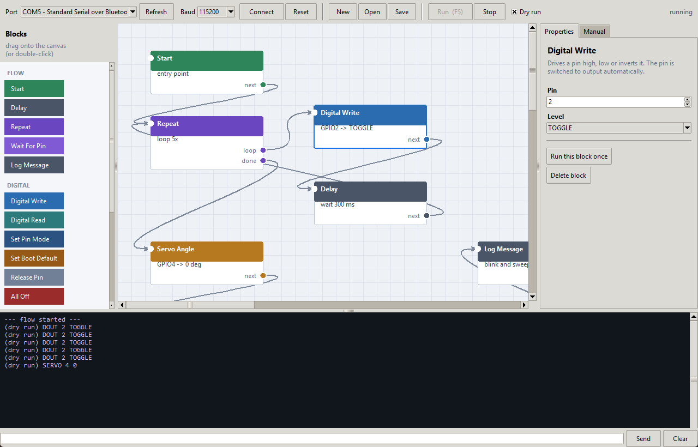

# y_automation

FreeRTOS GPIO automation firmware for the ESP32-C3, plus a drag-and-drop desktop
app that drives it over USB serial.

The firmware exposes the pins of the board as a small line protocol: turn an
output on or off, give a pin a persistent power-on state, drive a hobby servo,
or run a pin as a square wave generator. The desktop app lets you wire those
actions into a sequence by dragging blocks onto a canvas, and run it.

```
   host (USB serial)                     ESP32-C3
  ┌──────────────────┐            ┌────────────────────────────────────┐
  │  y_automation    │  "DOUT 2 1"│  ┌────────────┐   Queue            │
  │  studio  (Tk)    │───────────▶│  │ usb_reader │──────┐             │
  │                  │            │  │  task 1    │      │             │
  │  or any terminal │◀───────────│  └────────────┘      ▼             │
  └──────────────────┘ "OK DOUT.."│                ┌────────────┐      │
                                  │                │ cmd_worker │─▶GPIO│
                                  │                │  task 2    │      │
                                  │                └────────────┘      │
                                  └────────────────────────────────────┘
```

---

## 1. Firmware

### 1.1 Layout

| File | Purpose |
| --- | --- |
| [src/main.cpp](src/main.cpp) | boot, restore saved defaults, start the tasks |
| [src/tasks.cpp](src/tasks.cpp) | the two RTOS tasks and the queue between them |
| [src/protocol.cpp](src/protocol.cpp) | line parsing and command execution |
| [src/pin_control.cpp](src/pin_control.cpp) | GPIO / LEDC / servo back end |
| [src/persist.cpp](src/persist.cpp) | boot defaults in NVS |
| [src/io.cpp](src/io.cpp) | mutex-protected serial output |
| [include/config.h](include/config.h) | pin mask, limits, task tuning |

### 1.2 The two tasks

**Task 1 — `usb_reader`** (priority 3) does nothing but drain the USB serial
port. It accumulates bytes until a newline, decodes the line into a fixed-size
`Command` struct and posts it to a FreeRTOS queue. It never touches a GPIO, so a
slow or long-running action can never stall input. Malformed lines are rejected
right there, and a full queue is reported as `ERR <CMD> QUEUE_FULL` rather than
silently dropped.

**Task 2 — `cmd_worker`** (priority 2) blocks on the queue, executes one command
at a time against the hardware and prints the reply. Being the only writer to
the pin state means no extra locking is needed around it.

`Command` is a plain struct with no pointers, so it travels through the queue by
value — no heap, no ownership questions. The queue holds `Y_QUEUE_LEN` (24)
commands, which is what lets the host stream a burst of lines without waiting
for each reply.

The Arduino `loop()` is left idle on purpose; all work lives in the two tasks.

### 1.3 Build and flash

```bash
pio run                        # build (default env)
pio run -t upload              # flash
pio device monitor             # 115200 baud, press Enter to send a line
```

Two environments are provided because the DevKitM-1 gives you two different
"USB serial" paths. Both speak the identical protocol:

| Environment | Serial path |
| --- | --- |
| `esp32-c3-devkitm-1` (default) | UART0 through the on-board USB-to-UART bridge |
| `esp32-c3-usbcdc` | native USB Serial/JTAG peripheral on GPIO18/GPIO19 |

```bash
pio run -e esp32-c3-usbcdc -t upload
```

### 1.4 Which pins are usable

`Y_PIN_MASK` in [include/config.h](include/config.h) decides which GPIOs the
firmware will touch. The default is `0x000007FF` — **GPIO0 … GPIO10**. The rest
are excluded because:

- **GPIO11 … GPIO17** are wired to the SPI flash. Driving them bricks the run.
- **GPIO18 / GPIO19** are the native USB D-/D+ lines.
- **GPIO20 / GPIO21** are UART0 RX/TX.

Anything outside the mask is rejected with `ERR <CMD> BAD_PIN`. To open up more
pins on a different board, override the mask:

```ini
build_flags = -D Y_PIN_MASK=0x003C07FF
```

Even inside the mask, mind the strapping pins: **GPIO2, GPIO8 and GPIO9** are
sampled at reset. Holding GPIO9 low at boot enters the bootloader, and on the
DevKitM-1 GPIO8 also drives the on-board addressable LED. They work fine as
outputs once the board is running, just do not hold them at an unusual level
across a reset.

---

## 2. Serial protocol

Line based ASCII, `\n` terminated (`\r\n` is fine too), **115200 baud**.
Verbs are case insensitive; arguments may be separated by spaces or commas.

### 2.1 Request and reply shape

```
[<seq>:]<VERB> [arg ...]
```

The optional numeric `<seq>` tag is echoed on every reply line belonging to that
request, which is how the desktop app keeps concurrent callers apart. Every
request produces **zero or more `DAT` lines followed by exactly one `OK` or
`ERR` line** — read until you see the terminator.

```
> 7:STATE
< 7:DAT pin=2 func=OUT level=1
< 7:DAT pin=4 func=SERVO angle=90.0 us=1500 min=500 max=2500
< 7:OK STATE n=2

> DOUT 99 1
< ERR DOUT BAD_PIN
```

Lines starting with `#` are informational (the boot banner). `RDY` is printed
once the tasks are running. Blank lines and `#` comments in input are ignored.

### 2.2 Commands

| Command | Description |
| --- | --- |
| `PING` | liveness check, replies `OK PING PONG` |
| `ID` | `OK ID name=… ver=… proto=… chip=… pinmask=0x…` |
| `HELP` | the command list, one `DAT` line each |
| `STATE [pin]` | live configuration of one pin, or of every configured pin |
| `MODE <pin> <func>` | `NONE`, `OUT`, `IN`, `IN_PULLUP`, `IN_PULLDOWN`, `SERVO`, `FREQ` |
| `DOUT <pin> <0\|1\|TOGGLE>` | drive a digital output (`ON`/`OFF`/`HIGH`/`LOW` also accepted) |
| `DREAD <pin>` | sample a digital input, replies `OK DREAD pin=3 level=0` |
| `SERVO <pin> <deg>` | 0…180, one decimal accepted (`SERVO 4 90.5`) |
| `SERVOUS <pin> <us>` | raw pulse width in microseconds |
| `SERVOCFG <pin> <min> <max>` | calibrate the pulse range that maps to 0 and 180 deg |
| `FREQ <pin> <hz> [duty%]` | square wave output, duty defaults to `50` |
| `DUTY <pin> <duty%>` | change the duty of a pin already running `FREQ` |
| `STOP <pin>` | detach servo/PWM hardware, park the pin as an input |
| `ALLOFF` | drive every output low and free every LEDC channel |
| `DEF <pin> <0\|1>` | persist the **power-on level** of an output |
| `DEFSNAP` | persist the whole live configuration as the boot state |
| `DEFCLR [pin]` | forget one stored default, or all of them |
| `DEFGET` | list the stored defaults |
| `DEFAPPLY` | re-apply the stored defaults now |
| `REBOOT` | restart the device |

Error reasons: `UNKNOWN_CMD`, `BAD_ARGC`, `BAD_PIN`, `BAD_ARG`, `BAD_LEVEL`,
`BAD_MODE`, `BAD_ANGLE`, `BAD_US`, `BAD_HZ`, `BAD_DUTY`, `WRONG_FUNC`,
`NO_LEDC_CHANNEL`, `HW_ERROR`, `NVS_WRITE`, `QUEUE_FULL`, `LINE_TOO_LONG`.

Note the split between the two layers: a value that is not a number at all is
rejected by the parser (`SERVO 4 abc` → `BAD_ANGLE`), while a well formed value
outside the allowed range is rejected by the pin layer (`SERVO 4 181` →
`BAD_ARG`).

### 2.3 Digital output

A pin does not need to be configured first — `DOUT` switches it to output
automatically:

```
DOUT 2 1        # high
DOUT 2 0        # low
DOUT 2 TOGGLE   # invert
DREAD 3         # read (switches the pin to a plain input if it was unused)
```

### 2.4 Boot defaults

`DEF` writes the power-on level of an output into NVS. The firmware applies
stored defaults in `setup()` **before** the reader task accepts its first
command, so an output is never briefly in an undefined state after a reset.

```
DEF 2 1        # GPIO2 comes up high from now on
DEFGET         # DAT def pin=2 func=OUT level=1  /  OK DEFGET n=1
DEFCLR 2       # forget it again
```

`DEFSNAP` captures everything at once — every configured pin including servo
angles, pulse ranges, frequencies and duty cycles. Set the board up the way you
want it, send `DEFSNAP`, and it comes back that way after every reset.

### 2.5 Servo

`SERVO` puts the pin on a 50 Hz LEDC channel and maps the angle onto a pulse
width. The default range is 500 – 2500 µs; calibrate it per servo with
`SERVOCFG` if the mechanical ends do not line up.

```
SERVOCFG 4 600 2400
SERVO 4 0
SERVO 4 90.5
SERVOUS 4 1500     # raw pulse, bypasses the angle mapping
STOP 4             # detach, the servo goes limp
```

Servos draw far more current than the board's regulator can supply — power them
from a separate supply and tie the grounds together.

### 2.6 Frequency output

`FREQ` runs the pin as a square wave on an LEDC channel.

```
FREQ 5 1000        # 1 kHz at 50 %
FREQ 5 25000 20    # 25 kHz at 20 %
DUTY 5 75          # change the duty, frequency unchanged
STOP 5
```

The usable range is **3 Hz to 10 MHz**, measured on an ESP32-C3 revision v0.4.
The firmware picks the highest duty resolution the LEDC source clock can sustain
at the requested frequency and reports it as `bits=` in the reply — the higher
the frequency, the coarser the duty steps:

| Frequency | Duty resolution | Duty steps |
| --- | --- | --- |
| 3 Hz – 2.4 kHz | 14 bits | 16384 |
| 10 kHz | 11 bits | 2048 |
| 100 kHz | 8 bits | 256 |
| 1 MHz | 5 bits | 32 |
| 10 MHz | 2 bits | 4 |

**1 Hz and 2 Hz are not reachable** and return `HW_ERROR`. The low speed LEDC
timers run from the 40 MHz crystal, and those frequencies would need more than
the hardware maximum of 14 duty bits to divide down that far. 3 Hz is the floor.

A request the driver refuses leaves the pin's previous configuration running and
untouched, so a rejected `FREQ` never silently stops an output.

The ESP32-C3 has **6 LEDC channels**, so at most six servo/frequency pins can be
active at once. The seventh returns `NO_LEDC_CHANNEL`; free one with `STOP`.

---

## 3. Desktop app



### 3.1 Install and run

```bash
pip install -r app/requirements.txt
python app/main.py
```

Only `pyserial` is needed; Tkinter ships with the standard Python installer on
Windows and macOS (`sudo apt install python3-tk` on Debian/Ubuntu).

The board is selected for you: the app ranks serial ports by USB vendor id and
preselects the most likely one, so a Bluetooth virtual port never wins over a
real board. Recognised ports are listed first and tagged with their vendor.

| Vendor id | Shown as | Typical hardware |
| --- | --- | --- |
| `303A` | Espressif | native USB Serial/JTAG on the SoC itself |
| `10C4` | Silicon Labs | CP210x bridge, e.g. ESP32-C3-DevKitM-1 |
| `1A86` | QinHeng | CH340 / CH9102 bridge |
| `0403` | FTDI | FT232R bridge |

Anything else is still listed and selectable, just never auto-picked. Press
**Refresh** after plugging a board in; a port you chose yourself is kept as long
as it is still present. The vendor also tells you which firmware you need —
`303A` means the `esp32-c3-usbcdc` build, anything else means the default one.

Press **Connect** and the app sends `ID` to confirm the firmware is there.
**Dry run** executes a flow without a device, logging every command it would
have sent — useful for checking a sequence before wiring anything up.

### 3.2 Building a flow

- **Drag** a block from the palette onto the canvas (or double-click it).
- **Drag a block** by its body to move it.
- **Drag from a coloured port** on a block's right edge onto another block to
  wire them together. **Right-click a port** to unwire it.
- **Click** a block to edit its parameters on the right; **Delete** removes it.
- **Drag the empty canvas** to pan.
- **Run this block once** in the properties panel fires a single action at the
  device without running the whole flow.

Execution starts at the **Start** block and follows the links. A block with
nothing wired to its output ends the flow.

| Shortcut | Action |
| --- | --- |
| `F5` | run the flow |
| `Esc` | stop the flow |
| `Ctrl+S` / `Ctrl+O` | save / open |
| `Delete` | delete the selected block |

### 3.3 Blocks

**Flow** — `Start` (entry point, one per flow), `Delay`, `Repeat`,
`Wait For Pin`, `Log Message`.

**Digital** — `Digital Write`, `Digital Read`, `Set Pin Mode`,
`Set Boot Default`, `Release Pin`, `All Off`.

**Servo** — `Servo Angle`, `Servo Pulse`, `Servo Range`.

**Frequency** — `Frequency Out`, `Change Duty`.

**Advanced** — `Raw Command`, which sends a literal protocol line.

`Repeat` has two outputs: wire **loop** into the body of the loop and wire the
end of that body back into the Repeat block; when the counter runs out, control
leaves through **done**. A count of `0` loops until you press Stop.

`Wait For Pin` polls a digital input until it matches and then continues through
**next**; if the timeout expires it leaves through **timeout** instead, so you
can handle both cases.

### 3.4 Flow files

Flows are plain JSON — a list of nodes with their position, parameters and
outgoing links. See [app/examples/blink_and_sweep.json](app/examples/blink_and_sweep.json),
which blinks GPIO2 five times and then sweeps a servo on GPIO4.

```json
{
  "id": "n3",
  "type": "digital",
  "x": 360, "y": 150,
  "params": { "pin": 2, "level": "TOGGLE" },
  "links": { "next": "n4" }
}
```

### 3.5 Manual tab

The **Manual** tab is a direct control panel — pin picker, on/off/toggle/read
buttons, a servo slider, a frequency generator, `STATE` and a panic `ALL OFF`.
The console at the bottom shows every line in both directions (`>` sent,
`<` received) and accepts typed protocol commands.

---

## 4. Releasing

Pushing a `v*` tag builds both firmware environments on GitHub Actions and
publishes a release with the binaries attached
([.github/workflows/release.yml](.github/workflows/release.yml)).

```sh
# 1. bump the version the firmware reports over ID
#    include/config.h -> #define FW_VERSION "1.1.0"
git commit -am "Release 1.1.0"

# 2. tag it and push
git tag -a v1.1.0 -m "v1.1.0"
git push origin main --follow-tags
```

The workflow **fails on purpose if the tag does not match `FW_VERSION`**, so a
binary can never report a version different from the release it ships in. Bump
`include/config.h` first, then tag.

Each release carries, for both environments:

| Asset | Flash at | Purpose |
| --- | --- | --- |
| `…-factory.bin` | `0x0` | everything in one image, for a blank chip |
| `…-firmware.bin` | `0x10000` | application only, keeps the existing bootloader |
| `…-bootloader.bin` | `0x0` | for flashing pieces individually |
| `…-partitions.bin` | `0x8000` | partition table |
| `…-firmware.elf` | — | symbols, for decoding a crash backtrace |

plus `…-studio.zip` (the desktop app, so firmware and control panel are always
the same vintage) and `SHA256SUMS.txt`.

`workflow_dispatch` is also enabled, so a release can be rebuilt from an
existing tag through the Actions tab without re-tagging.

Note that this is the only workflow, so a build break would first surface at tag
time. Say the word if you want a CI job that builds on every push as well.

## 5. Troubleshooting

**No reply at all.** Check you flashed the environment matching your cable path
(§1.3). Press **Reset** in the app, or `pio device monitor` and look for the
`#` banner and `RDY`.

**`ERR … BAD_PIN`.** The pin is outside `Y_PIN_MASK`; see §1.4.

**`ERR … NO_LEDC_CHANNEL`.** All six PWM channels are in use — `STOP` a pin
first.

**Servo jitters or resets the board.** It is being powered from the board's
3V3 rail. Give it its own supply and common the grounds.

**Connecting reboots the board.** The app parks DTR and RTS inactive on open so
it does not trigger the auto-reset circuit; use the **Reset** button when you
actually want a restart.

**Board resets when a pin goes high at boot.** You are driving a strapping pin
(GPIO2/8/9) — see §1.4.
